# lamalunga

> *Lamalunga* is the karst cave of the Alta Murgia, near Altamura, in
> Apulia, where on 3 October 1993 a group of speleologists found the Altamura
> Man, a Neanderthal skeleton of about 150000 years ago, still held in the
> calcite of the cave
> ([uomodialtamura.it](https://uomodialtamura.it/index.aspx?lang=ENG)).

A beamer theme, and a small LaTeX library, in which the proportions of the
page come from the golden ratio and the palette is computed from a single
color: one chooses the primary (by its hexadecimal code) and possibly a style,
and the accents, the tints, the canvas, the ink, the sizes of the type, the
margins and the spacings follow from that choice.

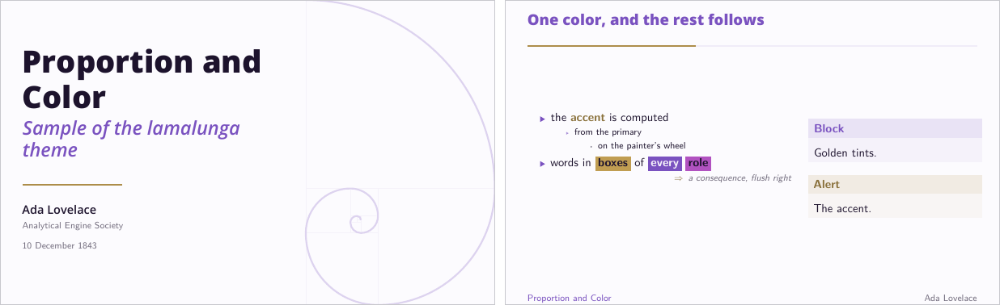

We wrote it for talks in which the hierarchy of the information is carried
by typography and color (there are no shadows, gradients or navigation
symbols), and in which the composition of a page follows from a rule that one
can state and check. Since the rules do not depend on beamer, they are also
available through the package `lamalunga.sty`, for articles, posters and
standalone figures.

## Contents

- [Quick start](#quick-start)
- [The principles](#the-principles)
- [Styles](#styles)
- [Color](#color)
- [Proportion](#proportion)
- [Typography](#typography)
- [Forms](#forms)
- [Page furniture](#page-furniture)
- [Commands](#commands)
- [The library outside beamer](#the-library-outside-beamer)
- [Demo, gallery and installation](#demo-gallery-and-installation)
- [The name](#the-name)

## Quick start

```latex
\documentclass{beamer}
\usetheme{lamalunga}                    % or e.g. \usetheme[style=bauhaus]{lamalunga}
\title{Proportion and Color}
\author{Ada Lovelace}
\begin{document}
\maketitle
\section{Harmony}
\begin{frame}{One color, and the rest follows}
  The \alert{accent} is computed from the primary.
\end{frame}
\begin{frame}[standout]
  Questions?
\end{frame}
\end{document}
```

The theme is written for LuaLaTeX (XeLaTeX works as well) and falls back to
pdfLaTeX with the same two families, loaded through their packages; the
title page and the focal points use TikZ overlays, and therefore need two or
three runs, which `latexmk -lualatex` does automatically. Options are given to
`\usetheme` and can be changed later with `\lamalungaset{...}`, except the
ones that shape the page (`aspect`, `margins`, `headline`, `font`, `weight`),
which only make sense in the preamble.

## The principles

Each principle below corresponds to code in the theme, and the section given
in parentheses describes the options that control it.

- **Golden section.** Lengths are cut in the ratio
  φ = (1 + √5)/2 ≈ 1.618: golden columns take 61.8% and 38.2% of the width,
  the rule under the title is φ⁻² of the title block, and title, section and standout
  frames put their content at the golden section of the free height (cf.
  [Proportion](#proportion)).
- **A golden page with golden margins.** By default the page measures
  161.8 mm by 100 mm, and the horizontal margin is φ times the vertical one;
  since (W − 2φm) / (H − 2m) = φ whenever W / H = φ, the block of text is
  again a golden rectangle (up to the rounding of the margins to whole
  points).
- **The root-two rectangle.** `aspect=sqrt2` gives the proportion of the A
  paper sizes, the only rectangle that keeps its shape when halved (the
  "dynamic rectangle" of classical layout).
- **Fibonacci spacing.** Margins, gutters, paddings and vertical skips are
  Fibonacci numbers of points (3, 5, 8, 13, 21, 34, 55), computed by Binet's
  formula; as consecutive ones are in a ratio close to φ, the two margins are
  21 pt and 13 pt by default.
- **A modular scale of type.** Each size is the base size times a power of a
  ratio (φ by default, or a musical interval: minor third 6/5, major third
  5/4, fourth 4/3, fifth 3/2, octave 2), with half steps for the small print;
  the half step of the golden scale, √φ, is the ratio of the sides of the
  Kepler triangle. The size commands of LaTeX (`\small`, `\Large`, and so
  on) are moved onto the same scale.
- **Golden leading.** Body text has a leading of 1 + φ⁻³ ≈ 1.236 times its
  size (as dense as a slide needs, and incidentally the leading of beamer
  itself) and display sizes of 1 + φ⁻⁴ ≈ 1.146, since large type usually
  needs less air between the lines.
- **Optical center.** The eye tends to place the center of a page a little
  above the geometric one; hence title, section and standout pages (and any frame with the
  option `golden`) leave 38.2% of the free height above their content and
  61.8% below.
- **Rule of thirds and golden guides.** While one composes, `guides` draws
  the thirds and the golden sections of the page, and `\focalpoint` places an
  object on one of the four intersections, where the eye often goes first.
- **Measure.** A `measure` environment keeps a paragraph within 2.5
  lowercase alphabets (about 66 characters), the line length that typography
  manuals usually give as the most readable one (45 to 75 characters).
- **One color, and the others by rotation of the hue.** Accents are computed
  from the primary by turning its hue on the painter's wheel (red,
  yellow, blue, on which violet calls for yellow) or on the RGB one:
  complementary, split complementary, triadic, analogous, tetradic, and the
  monochromatic scale (tone on tone), in which the accents are a shade and a
  tint of the primary (cf. [Color](#color)).
- **The 60-30-10 rule of interior design.** Roughly 60% of the page is the
  dominant color (the canvas, a breath of the primary), 30% the secondary
  (the primary, on titles, items and the progress track) and 10% the accent
  (alerts and the filled part of the progress bar); the accent is kept rare,
  as Itten's contrast of extension recommends for a pair of complementary
  colors.
- **Golden tints.** Each role color comes in eight tints, the k-th being
  φ⁻ᵏ of the color mixed with the canvas (61.8%, 38.2%, 23.6%, 14.6% and so
  on), which gives the fills of blocks, tracks and highlights.
- **Tinted neutrals.** Unless asked for, text is not pure black and the
  canvas is not pure white: the ink is a deep shade of the primary, the canvas
  a faint tint of it (in paper mode, an ivory warmed towards ochre and veiled
  by the primary, much as a neutral wall is chosen to rest a strong color in a
  room).
- **Computed contrast.** When the document is compiled, the relative
  luminance of the palette is computed (WCAG 2), and a color used for text is
  moved in lightness, keeping its hue, until it reaches 4.5:1 against the
  canvas (7:1 with `contrast=AAA`); colors used for graphics only have to
  reach 3:1 (4.5:1). A highlight takes the darker or the lighter ink,
  whichever contrasts more with its fill.
- **Light, dark and paper.** Three modes are computed from the same primary
  with the same rules, and a talk goes from one to the other by changing one
  option.
- **Forms in proportion.** Bullets are arrows (triangles pointing right) or
  squares whose side shrinks by φ at each level, or the square, circle and triangle of the Bauhaus with equal areas
  (so that no shape outweighs the others) and an area that shrinks by φ at
  each level; capitals are letterspaced by φ⁻⁶ of the em; lines are a hairline of φ⁻² pt or a
  rule of φ pt; the padding of a highlight is φ times wider than it is tall;
  corners are square or rounded with a radius of φ⁻³ em; images are cropped to
  a golden rectangle.
- **The golden spiral.** On the title page, the golden rectangle of the page
  is cut into its squares: the title sits in the first one, and the spiral
  turns in the others.
- **Styles, as in interior design.** A single choice (`bauhaus`, `swiss`,
  `nordic`, `classical`, `japandi`) sets the weight of the titles, the
  primary, the harmony, the mode and the forms of a coherent idiom (the two
  families stay the same in every style), each of which can still be
  overridden (cf. [Styles](#styles)).
- **Typographic accent.** The hierarchy is carried by weight and color: the
  titles are set in Open Sans ExtraBold in the primary, over a text and a
  mathematics in Computer Modern, alerts are in bold, and the words that
  matter can be set in boxes filled with the colors of the harmony, in the ink
  that contrasts more with each fill (as can the titles, with
  `titles=boxed`); a consequence can be added flush right, after an arrow in
  the accent (`\hence`).
- **Logos of equal weight.** Logos are scaled to the same area (that of a
  golden rectangle 21 pt high) rather than to the same height, since a wide
  and low logo would otherwise outweigh a square one.
- **Golden weights.** The bold of the text is the weight of Latin Modern
  Sans whose stems are closest to φ times those of the regular one, i.e., the
  Bold (1.77, against 1.43 for the demi-condensed); the weights of Open Sans
  step by about √φ (Light 0.60, SemiBold 1.40, Bold 1.85, ExtraBold 2.34
  times the Regular), so that the ExtraBold of the titles stands two steps
  above the SemiBold of subtitle and author, and the Light of `weight=light`
  is close to φ⁻¹.
- **Typographic details.** These are optical margin alignment (`microtype`), figures of
  equal width in tables, letterspaced capitals (`\lamalungacaps`), one family
  for display text and one for the text, with the mathematics and the
  typewriter that belong to the latter, section numbers on two digits.
- **Less, but better.** Dieter Rams's principle of reduction and the Japanese
  *ma*, the value of the empty space: we draw no shadows, gradients or
  frames around the text, and we keep the margins generous.

## Styles

A style is a coordinated set of defaults, in the way a style of interior
design fixes materials, colors and shapes once the room has been given its
character. Options written after `style` override the ones it sets, e.g.,
`\usetheme[style=nordic, primary=8A5A44]{lamalunga}` keeps the nordic idiom
with a different color.

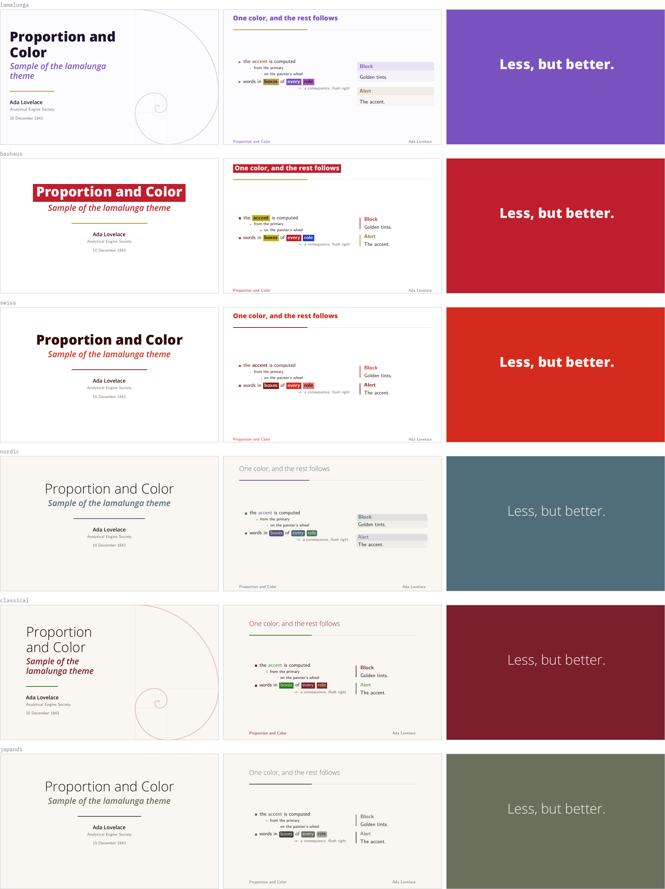

Every style sets its titles, subtitle and author in Open Sans and its text,
mathematics and code in Computer Modern; the styles differ in the weight of
the titles and in everything else.

| style | titles | primary | harmony | mode | forms |
|---|---|---|---|---|---|
| `lamalunga` (default) | ExtraBold | `7A52C0` violet | complementary | light, tinted | bold titles, bold alerts, arrows, tinted blocks, title and author in the foot line, spiral |
| `bauhaus` | ExtraBold | `BE1E2D` red | triadic: red, yellow, blue | light, white | boxed titles and alerts, Bauhaus bullets, rule blocks |
| `swiss` | ExtraBold | `D52B1E` red | monochromatic | light, white | bold alerts, rule blocks, narrow margins |
| `nordic` | Light | `4F6D7A` slate | analogous | paper | rounded corners, tinted blocks |
| `classical` | Light | `7A1F2B` burgundy | complementary | paper | rule blocks, wide margins, spiral |
| `japandi` | Light | `6B705C` olive gray | monochromatic | paper | rounded corners, rule blocks, wide margins |

## Color

Colors are defined as soon as the theme is loaded, and redefined by
`\lamalungaset`; one can use the names below in the document as any xcolor
color.

| color | role |
|---|---|
| `lamalunga-seed` | the primary as given |
| `lamalunga-primary` | the primary, adjusted for contrast with the canvas |
| `lamalunga-a1`, `lamalunga-a2` | the two harmony colors, as computed by the wheel |
| `lamalunga-accent`, `lamalunga-accent2` | the same, adjusted for text |
| `lamalunga-accent-vivid` | the first accent, adjusted for graphics only |
| `lamalunga-canvas`, `lamalunga-ink`, `lamalunga-muted` | background, text, secondary text |
| `lamalunga-on-primary` | text on a primary fill (standout frames, boxed titles) |
| `<role>-t1` ... `<role>-t8` | golden tints of primary, accent, accent2, accent-vivid and ink |
| `lamalunga-complement`, `-split-a`, `-split-b`, `-triad-a`, `-triad-b`, `-analog-a`, `-analog-b`, `-tetrad-a`, `-tetrad-b`, `-tetrad-c` | every rotation of the primary |

### `primary=<hex>`

A color given by its six hexadecimal digits (without `#`), from which the
rest of the palette follows.

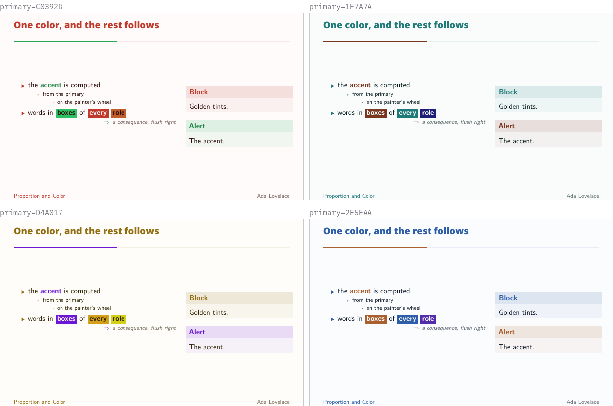

### `harmony=complementary|split|triadic|analogous|tetradic|monochromatic`

How the two accents are obtained from the primary: the complement (180°) and
an analogous color (30°); the two neighbors of the complement (150° and
210°); the two thirds of the circle (120° and 240°); the two neighbors of the
primary (±30°); the square (90° and 180°); or, for the monochromatic scale, the
golden shade and the golden tint of the primary. In each palette below,
the first three swatches are the primary and the two harmony colors as
computed, and the fourth one is the accent after the adjustment for
contrast (which may darken it considerably on a light canvas).

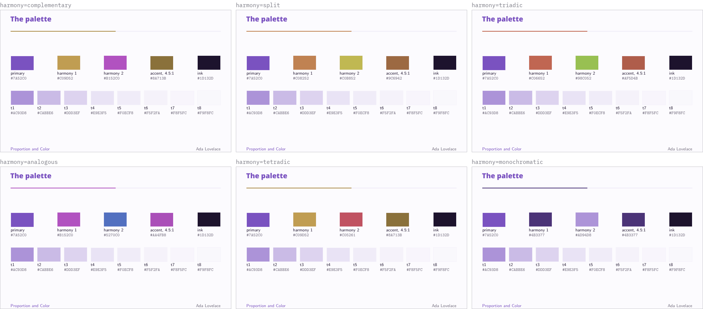

### `wheel=artist|rgb`

The circle on which the hue is turned: `artist` (default) is xcolor's tuned
wheel, on which the complement of violet is yellow as on the painter's
red-yellow-blue circle; `rgb` is the wheel of light, on which it is a yellow
green.

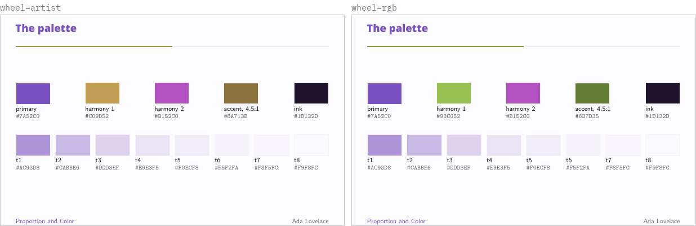

### `mode=light|dark|paper` and `canvas=tinted|white`

In light mode, the canvas is tinted by φ⁻⁸ of the primary (or pure white
with `canvas=white`) and the ink is a deep shade of it; dark mode turns them
round, and paper mode has an ivory canvas, warmed towards ochre and veiled by
the primary.

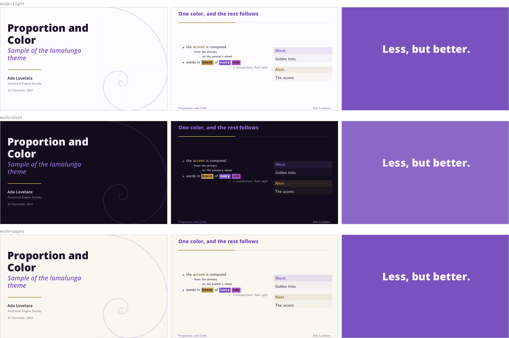

### `contrast=AA|AAA`

This is the target of the adjustment, i.e., 4.5:1 for text and 3:1 for
graphics (AA), or 7:1 and 4.5:1 (AAA); the figure uses a pale primary,
`9B7FD4`, to make the difference visible.

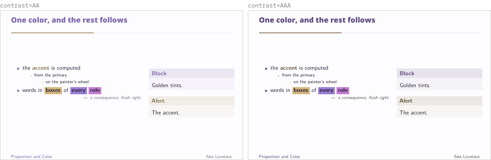

## Proportion

### `aspect=golden|sqrt2|beamer`

The shape of the page: φ:1 (161.8 mm by 100 mm), √2:1 (141.4 mm by 100 mm), or
the one of the beamer class option `aspectratio` (e.g., 16:9 with
`\documentclass[aspectratio=169]{beamer}`).

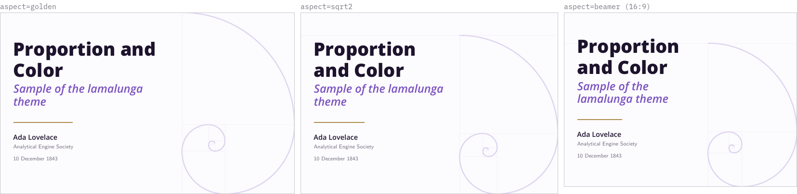

### `margins=narrow|normal|wide`

Two consecutive Fibonacci numbers for the vertical and the horizontal margin:
13 pt and 21 pt (default, the density a talk needs), 21 pt and 34 pt, 34 pt and
55 pt (the empty space of the nordic, classical and japandi styles).

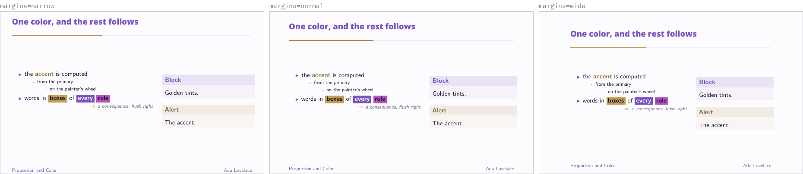

### `ratio`, `leading`, `display-leading`

The ratio of the modular scale (`golden`, `minorthird`, `majorthird`,
`fourth`, `fifth`, `octave`, or a number) and the two leadings, as factors of
the size (defaults 1.236 and 1.146). The base of the scale is the size of the
class (the option `11pt` of beamer is in fact 10.95 pt); with it and the
golden ratio, frame titles are 13.93 pt (a half step, √φ times the text),
titles 28.67 pt and the small print 8.61 pt. The size commands of LaTeX
are moved onto the same scale, in quarter steps where the classic sizes are
closer than a half step, so that a `\small` or a `\Large` written in the
document is a power of the ratio as well:

| command | step | size (pt) | | command | step | size (pt) |
|---|---|---|---|---|---|---|
| `\tiny` | −3/2 | 5.32 | | `\large` | 1/4 | 12.35 |
| `\scriptsize` | −1 | 6.77 | | `\Large` | 1/2 | 13.93 |
| `\footnotesize` | −1/2 | 8.61 | | `\LARGE` | 1 | 17.72 |
| `\small` | −1/4 | 9.71 | | `\huge` | 3/2 | 22.54 |
| `\normalsize` | 0 | 10.95 | | `\Huge` | 2 | 28.67 |

## Typography

### `font=lamalunga|none`

The theme uses two families, the same in every style. Titles, frame titles,
subtitle, author, section and standout pages are set in Open Sans, with its
ExtraBold for titles and its SemiBold for subtitle and author; the text is set
in Latin Modern Sans, the sans of Computer Modern, with Latin Modern Math for
the mathematics (through `unicode-math` with LuaLaTeX and XeLaTeX) and Latin
Modern Mono for code, all with their optical sizes. `none` leaves the fonts,
and the mathematics, to the document; it is also the option to use in a
document that relies on packages which do not work with `unicode-math`.

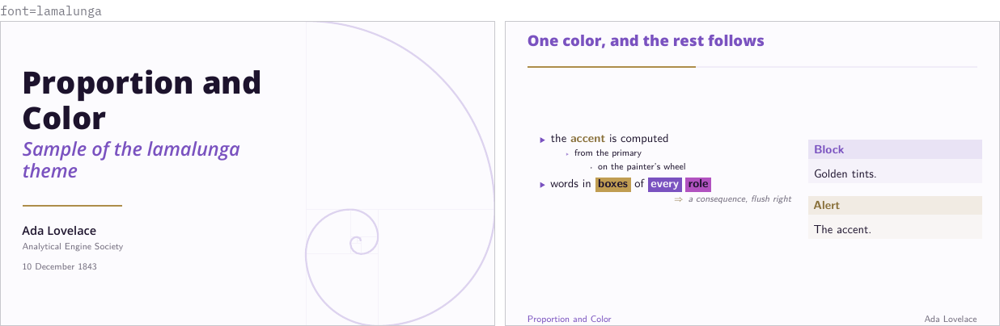

### `weight=bold|light`

The weight of display text (titles, frame titles, section and standout pages):
the ExtraBold of Open Sans by default, or its Light, which gives a quieter
page; with `light` the words in a highlight are no longer set in bold.

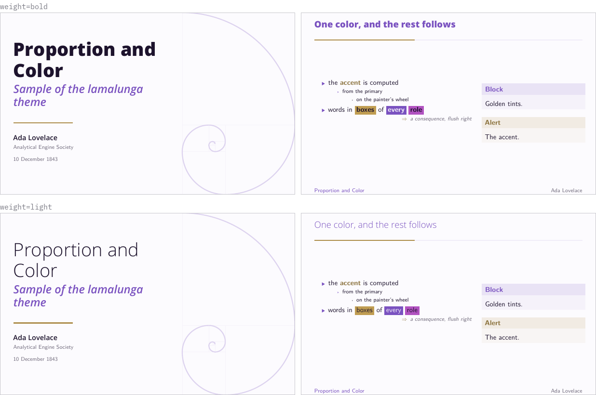

## Forms

### `titles=plain|boxed` and `alerts=bold|color|boxed`

Plain titles (the default) are set in bold in the primary; boxed titles set
the frame titles, the title and the section titles in a box of the primary,
and a title broken with `\\` gets one box per line. Without the spiral, the
title page is centered horizontally (and stays at the golden section of the
height). Alerts are in the first accent and in bold by default, in the accent
alone with `color`, or a highlight of the accent with `boxed`.

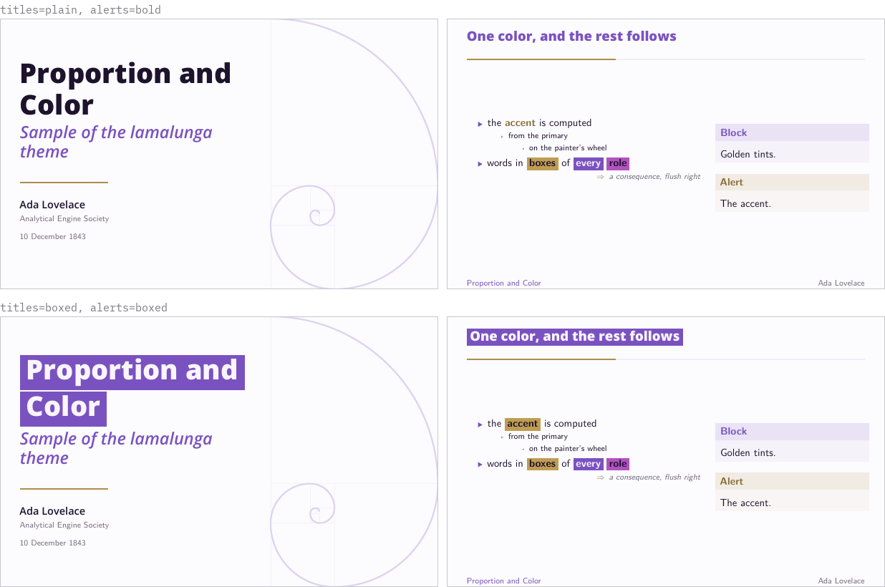

### `blocks=tinted|rule` and `corners=square|rounded`

Blocks are either a title band and a body in golden tints of their role
color, or a single rule of φ pt at their left, with no fill; rounded corners
apply to tinted blocks, highlights and golden images.

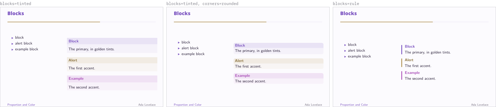

### `bullets=arrows|golden|bauhaus`

Arrows (the default), golden squares, or the Bauhaus shapes; in every case
the size shrinks by φ at each level.

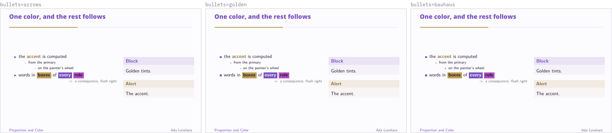

## Page furniture

| option | values | default |
|---|---|---|
| `progressbar` | `frametitle`, `head`, `foot`, `none` | `frametitle` |
| `numbering` | `fraction`, `counter`, `none` | `fraction` |
| `footline` | `credits` (the short title at the left, the author at the right), `none` (a free page, with its bottom margin), `running` (the short institute at the left, the frame number at the right), `minimal` (author and title at the left, the number at the right), `infolines` (three fields in the proportion 1 : φ : 1) | `credits` |
| `headline` | `none`, `running` (the short title at the left, the author at the right, over a hairline), `miniframes` (the navigation dots of the classic themes) | `none` |
| `sectionpage` | `progressbar`, `toc` (the outline at each section), `none` | `progressbar` |
| `spiral` | `true`, `false` | `true` |
| `guides` | `none`, `thirds`, `golden`, `both` | `none` |

Frames after `\appendix` are not counted in the total, and standout frames
are not numbered.

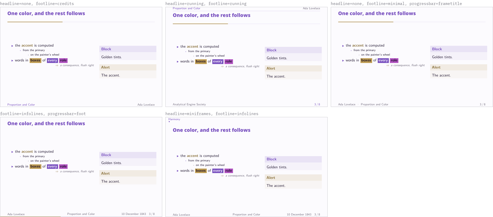

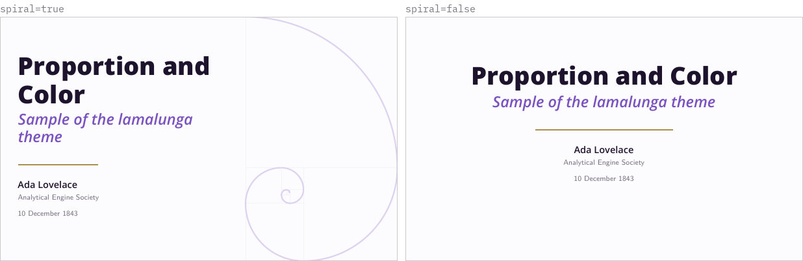

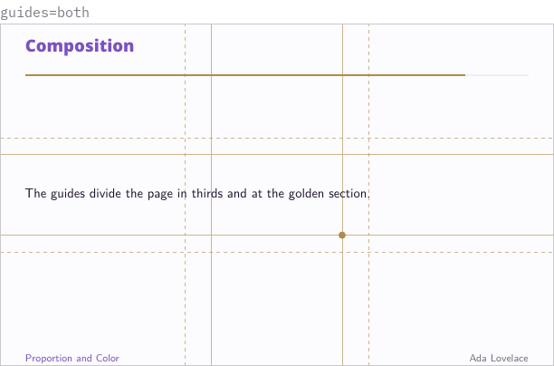

## Commands

| command | effect |
|---|---|
| `\begin{frame}[standout]` | a frame in the primary, with its content at the golden section |
| `\begin{frame}[golden]` | the content of any frame at the golden section of the free height |
| `\begin{goldencolumns}[major\|minor] ... \nextcolumn ... \end{goldencolumns}` | two columns of 61.8% and 38.2% of the width, the major first unless `minor` is given |
| `\highlight[role]{text}` | the text, in bold, in a box of a color of the palette (`primary`, `accent`, `accent2`, `complement`, `triad-a`, `split-b`, and so on, or any xcolor name), in the ink of higher contrast; the default is the first accent |
| `\addaffiliation{key}{text}`, `\addauthor{name}{keys}` | authors in a grid on the title page, each with the marks († ‡ § ¶) of its affiliations, which follow in the small print; the short author becomes "first author et al." |
| `\addlogo{file}` | logos in a row under the date, aligned as the rest of the title page, all with the area of a golden rectangle 21 pt high |
| `\slidenote{text}`, `\slidecite{key}` | a note with no mark at the foot of the frame, and (with biblatex) the author, title and year of a reference |
| `\hence{text}` | a consequence of the line above, flush right in the small print, after an arrow in the accent |
| `\goldenimage[width]{file}` | the image scaled to cover a golden rectangle and cropped |
| `\focalpoint[thirds\|golden]{nw\|ne\|sw\|se}{content}` | the content centerd on an intersection of the guides |
| `\lamalungaprogressbar{width}` | the progress bar, anywhere |
| `\lamalungacaps{text}` | capitals, letterspaced |
| `\lamalungaset{options}` | change options in the middle of a talk |

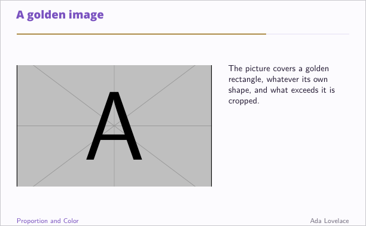

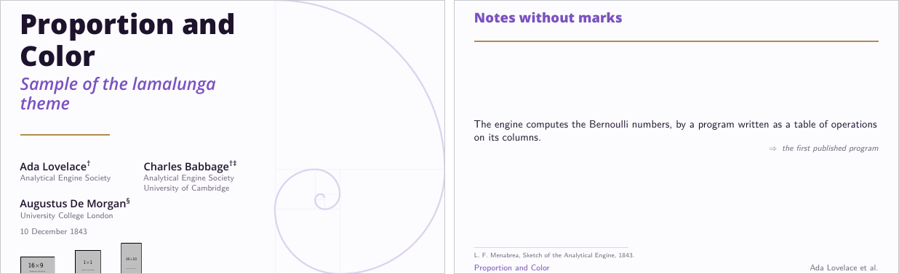

## The library outside beamer

`\usepackage{lamalunga}` gives the same machinery to any document.

| command | effect |
|---|---|
| `\goldenratio`, `\goldenpower{k}` | φ and φᵏ (expandable) |
| `\goldenmajor{length}`, `\goldenminor{length}` | the two parts of a length cut at the golden section |
| `\fib{n}`, `\fibskip{n}`, `\fibspace{n}` | the n-th Fibonacci number, and a vertical or horizontal skip of that many points |
| `\modularscale{k}`, `\modularleading{k}`, `\modularsize{k}` | size and leading of step k of the scale, and the font size command |
| `\colorharmony{prefix}{color}` | all the rotations of a color, as `prefix-complement`, `prefix-triad-a`, ... |
| `\complementcolor{name}{color}` | the complement alone |
| `\goldentint[towards]{color}{k}`, `\goldenshade{color}{k}` | φ⁻ᵏ of a color on the way to white (or another color) or to black, inside any color expression |
| `\ensurecontrast[ratio]{name}{color}{background}` | the color moved in lightness until it reaches the ratio |
| `\contrastratio{fg}{bg}`, `\checkcontrast[ratio]{fg}{bg}` | the WCAG ratio of two colors, and a warning when it is below the target |
| `\readableon{name}{background}{dark}{light}` | whichever of two inks contrasts more |
| `\goldenspiral[tikz options]{height}`, `\lamalungaspiral` | the golden rectangle, its squares and its spiral |
| `\begin{measure}[alphabets] ... \end{measure}` | a paragraph of readable length |
| `\lamalungahairline`, `\lamalungarule` | line weights of φ⁻² pt and φ pt |

If `pgfplots` is loaded, plots cycle through the colors of the palette (with
muted axes and a grid in a faint tint), and if `listings` is loaded, code is
colored by the style `lamalunga`.

## Demo, gallery and installation

The two demos, [`demo/lamalunga-demo.pdf`](demo/lamalunga-demo.pdf) and
[`demo/lamalunga-demo-dark.pdf`](demo/lamalunga-demo-dark.pdf), describe the
theme with the theme: the numbers and colors on their slides are computed
when they are compiled. The images of this page are made by
`doc/gallery/build.py` from `doc/gallery/sample.tex` (it needs Pillow and
pdftoppm).

```sh
make demo       # compile the demos with LuaLaTeX
make gallery    # rebuild the images of the README
make install    # copy the .sty files to TEXMFHOME
```

The fonts are the ones of TeX Live (Open Sans, and Latin Modern with its
mathematics), and a full TeX Live installation needs no other font.

## The name

Beamer themes are named after places; this one takes its name from the cave
quoted at the top of the page, near the town of its author.

## License

The LaTeX Project Public License, version 1.3c or later (see `LICENSE`).
